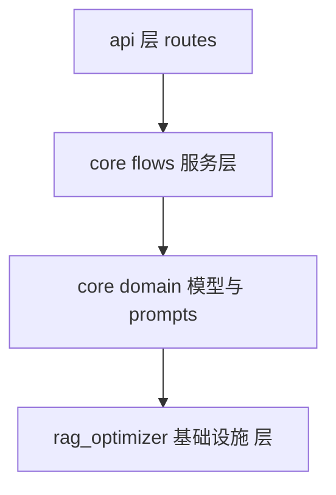

# Phase 2 统一架构设计与迁移方案（目标版本 v0.1.0）

> 目标：消除 api、core、rag_optimizer 之间的重复与耦合，形成清晰分层；以 core 为业务中心，api 仅做薄路由；rag_optimizer 专注底层引擎与基础设施。

## 一、现状与重复点梳理

- 配置重复：[`api/config.py`](api/config.py) 与 core 内部配置加载散落于 [`core/flows/base.py`](core/flows/base.py)
- LLM 调用重复：[`api/simple_chat.py`](api/simple_chat.py) 内各 provider 分支 与 BaseFlow 的调用封装逻辑相似
- SSE 解析重复：BaseFlow 与简单聊天均有解析逻辑
- 文档读取与仓库下载重复：[`api/data_pipeline.py`](api/data_pipeline.py) 与 [`core/ingestion/ingestor.py`](core/ingestion/ingestor.py)
- 检索与“引擎”边界不清：[`rag_optimizer/pipeline/rag_engine.py`](rag_optimizer/pipeline/rag_engine.py) 与 [`rag_optimizer/integration/deepwiki_adapter.py`](rag_optimizer/integration/deepwiki_adapter.py) 的职责重叠

## 二、分层与依赖方向

规则：上层只能依赖下层；禁止环形依赖。

- routes 层：仅路由、鉴权、序列化，调用 services，不直接触达 infra
- services 层：业务编排（Wiki/Chat/Research/DataIngest），依赖 domain 与 infra 接口
- domain 层：纯模型与模板（dataclass、prompt 模板），无 IO
- infra 层：数据库模型与仓储、检索器、嵌入、下载器、配置加载、LLM 客户端适配器等

## 三、模块归位与边界

- 配置统一：新增 core/config
  - 迁移与统一 `load_*_config`，环境变量覆盖策略；api 保留薄重导出
- LLM 客户端统一：新增 core/utils/llm.py
  - 提供 LLMClient 接口，多 provider 适配器（dashscope、openai、google、openrouter、ollama）
  - BaseFlow 与 api 统一通过 LLMClient 调用
- SSE 工具：新增 core/utils/sse.py
  - 输出 parse_sse_chunk、流式聚合工具，替换重复实现
- 仓库与文档：新增 core/utils/repo.py、core/utils/documents.py
  - 从 `api/data_pipeline.py` 提取 `download_repo` 与 `read_all_documents`
  - [`core/ingestion/ingestor.py`](core/ingestion/ingestor.py) 改用新工具
- 检索统一：以 PgvectorRetriever 为唯一入口
  - 保留 [`rag_optimizer/integration/deepwiki_adapter.py`](rag_optimizer/integration/deepwiki_adapter.py) 的 PgvectorRetriever
  - 评估 [`rag_optimizer/pipeline/rag_engine.py`](rag_optimizer/pipeline/rag_engine.py) 定位；保留为实验特性或下沉为实现细节
- API 瘦身：api 路由薄层
  - websocket 与 REST 仅做入参校验与结果返回，调用 core flows
  - `DatabaseManager` 降级为适配器或删除（保留兼容外观）
- Domain 模型：继续在 core/models 维护 dataclass（WikiPage/WikiSection/WikiStructure/Message/ResearchStage）
  - SQLAlchemy 仍位于 rag_optimizer/db/models.py 作为 infra

## 四、迁移步骤（提交粒度）

> ✅ 全部完成于 `dev/api` 分支，对应 v0.1.0 标签。

| # | 步骤 | 提交 | 状态 |
|---|------|------|------|
| 1 | 建立 core/config 并统一配置加载；api/config.py 薄重导出 | `56cf6e4` | ✅ |
| 2 | 抽象 core/utils/llm.py，迁移 provider 适配 | `46ef1a6` | ✅ |
| 3 | 抽取 core/utils/sse.py，替换 BaseFlow 与 api 的 SSE 解析 | `46ef1a6` | ✅ |
| 4 | 新增 core/utils/repo.py、documents.py，迁移下载与读取 | `7731a6d` | ✅ |
| 5 | 统一检索接口：确认 PgvectorRetriever 为唯一入口；梳理 rag_engine 定位 | `879834c` | ✅ |
| 6 | API 瘦身：DatabaseManager 标记弃用；api 路由保持向后兼容 | `879834c` | ✅ |
| 7 | 全局替换 import 路径，提供兼容重导出 | `5e1abb6` | ✅ |
| 8 | 完整回归：ingest/wiki/chat/research 全路径验证 | 已验证通过 | ✅ |
| 9 | 文档与版本：更新 docs，打 v0.1.0 标签 | 当前步骤 | ✅ |

每步单独提交，保证可回滚。

## 五、兼容策略与风险

- 兼容：api 对外接口不变；内部实现委托 core
- 风险：
  - LLM 流式输出与 SSE 细节差异 → 统一在 core/utils/sse.py
  - Provider 行为差异 → 在 LLMClient 适配层吸收
  - 文档过滤规则差异 → documents.py 中集中管理

## 六、完成标准

- 单一 LLMClient 入口、单一 PgvectorRetriever 入口
- api 路由无业务逻辑，仅调用 core flows
- 文档、配置、检索、SSE 均只在一个位置实现

## 七、里程碑（全部完成 ✅）

| 里程碑 | 内容 | 完成提交 | 状态 |
|--------|------|----------|------|
| M1 | 配置与 LLM 统一 | `56cf6e4` `46ef1a6` | ✅ |
| M2 | IO 工具与 SSE 统一 | `46ef1a6` `7731a6d` | ✅ |
| M3 | 检索接口统一与 API 瘦身 | `879834c` `5e1abb6` | ✅ |
| M4 | 回归测试与 v0.1.0 发布 | 当前 | ✅ |

